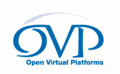

# Information on Open Virtual Platforms (OVP)
This repository holds information on the open-standard OVP (Open Virtual Platforms) APIs.  
Please look in the directories below for resources and information related to OVP and OVP processor models.

This repository was created in 2023 with the move to focus on Open Standards.

The downloads, such as riscvOVPsimPlus.exe and riscvISATESTS that were previously available from OVPworld.org, these can be accessed from your normal Imperas or Synopsys download sites. 

## About OVP

The fundamentals of OVP are the public open-standard APIs that have been developed by Imperas over the last 15 years with a focus on fast instruction accurate processor models and their related virtual platforms. These public APIs are now documented in this repository.

Many companies over the years have been involved and have built models and tools that made use of these OVP APIs. Imperas was the main driving force and is now a simulation/modeling team as part of Synopsys, Inc. The Imperas group oversee and evolve this repository and these APIs.

For information on the history of OVP look at the end of this file.  

## OVP and RISC-V
With the evolution of RISC-V since 2016, Imperas has added many RISC-V related OVP models - including various RISC-V related Instruction Set Simulators (ISS) used for RISC-V compliance level checking, used for RISC-V Design Verification, and RISC-V software development.
Please contact Synopsys / Imperas for more information on how to access these.

## OVP Technology - Modeling APIs
Within OVP, models are created by writing code calling functions in a specific modeling API. These APIs are based around C and are normally used with C, though there are templates available for use with C++ and SystemC.

To model an embedded system there are several main items to be modeled: Platforms, Processors, Peripherals and environment. The platform purely connects and configures the behavioral components. The processors fetch and execute object code instructions from the memories, and the peripherals model the components and environment that the operating system and application software interacts with.

Imperas' current focus is the Imperas Fast Processor Models (ImperasFPMs) that use the VMI APIs.

OVP modeling comprises several APIs; OP, VMI, BHM/PPM.

### OVP Technology - VMI (Virtual Machine Interface - for modeling processors)
For processor modeling there is the VMI API. These API functions are called from your C code and provide the ability to easily describe the behavior of the processor. A processor model written in C using the VMI basically decodes the target instruction to be simulated, translates this to x86 instructions that are then executed on the PC. VMI can be used for modeling 8, 16, 32, and 64 bit architectures and has extensions for VLIW, DSP etc. There is an interception mechanism enabling the trapping of calls to functions in the application runtime libraries such as printf without requiring the modifying of processor models.

### OVP Technology - OP (Open Platforms - for controlling models & constructing platforms)
For platforms there is the OP API for constructing, controlling, connecting, and observing platforms. This API can be called from C, C++, or SystemC. Platforms are made up of modules and are controlled with a test bench or test harness. The module provides the basic structure of the design and creates, connects, and configures the components. The module also specifies the address mapping, and software that is loaded on the processors. It is very easy with OP to specify very complex and complete platforms of many different processors, local and shared memories, caches, bus bridges, peripherals and all their complex address maps, interrupts and operating systems and application software. OP is also used to construct the test harnesses that instance the platforms and controls the simulation of them.

### OVP Technology - PPM & BHM (for behavioral peripheral modeling)
Behavioral components, peripherals, and the overall environment is modeled using C code and calls to these two APIs. Underlying these APIs is an event based scheduling mechanism to enable modeling of time, events, and concurrency - it is normally very easy to model functionality of embedded system components. Peripheral models provide callbacks that are called when the application software running on processors modeled in the platform access memory locations where the peripheral is enabled. These APIs provide extremely efficient behavioral modeling capabilities.

## OVP Technology - Documentation
In this repository in the directories below, there are the very complete reference documentation, application notes, online documents, header files and examples of all of the different functions in each API. Please view these documents for full explanation and reference. All this documentation is included in the Imperas product packages available from Synopsys.

In the Imperas product packages there is full Doxygen information on each API.

## OVP Processor Model Library
In this repository in the directories below, there is the processor model documentation for many of the models currently publicly available from Synopsys / Imperas.  

## History of OVP
Open Virtual Platforms and the original OVPworld.org website was set up in 2008 by Simon Davidmann as part of the Imperas initiative to educate industry about the use of simulation and the technologies related to virtual platforms as tools and methodologies utilized in the development of embedded systems and their software.

Research had shown that virtual platform technologies enabled the adoption of Continuous Integration to streamline the process of developing embedded software. The combination of Continuous Integration and Virtual Platforms allows the creation of development environments that provided higher quality embedded software to be developed in shorter timescales.

"With the creation of OVP we are sharing, making public, and making available our simulation infrastructure technologies with the intention of establishing a common, open standard platform for software virtual platforms for software developers. Imperas will support and initially manage the OVP site, and will contribute much of our innovation to keep this infrastructure evolving. However, it is not solely through our efforts that these technologies will become widely adopted and successful. Participation of organizations and individuals around the world is critical to the success of OVP. We thank all those that are participating in this community."
Simon Davidmann, Imperas President & CEO, Jan 2008.

Imperas built its very successful simulation technology to implement the APIs and make this available in their simulators available to industry, universities, and open source groups. Imperas created over 600 models of processors, peripheral components and platforms using these APIs. These models are all available as part of the Imperas simulation packages available from Synopsys.

A key part of OVP was the evolution of public APIs which allowed models to be developed using C, C++ that made use of the APIs.

When it was started there were some 25 companies involved and several universities and individuals. Imperas created many of the initial models though the SPARC model was created by Southampton Univ., there was a proprietary VinChip processor model, and several platforms running operating systems and demos were contributed.

## Evolution of OVP
Over years of usage OVP users highlighted some shortcomings and Imperas worked to address those. There were a couple of main areas. The first was in the ability to model platforms that have hierarchy. Many systems are built by designing sub-systems, or modules and re-using these modules in other designs. For example a micro-controller might have a common central module but many different flavors of part. This was addressed by the creation of the Open Platforms (OP) API in OVP that replaced the original ICM API for modeling and controlling platforms. OP has all the capabilities of ICM and much more, including the specification and usage of hierarchical modules.

Another capability added with OVP was an Instruction Set Simulator (ISS) that means that users could start developing embedded software for a processor without the need to build a platform. Today in the OVP packages available from Synopsys the ISS can make use of over 300 different processor variants without the need to specify a platform. You just load in an elf file, optionally connect up a debugger and get simulating. There are now several different flavors of ISS including several specific to RISC-V processors.

With OVP you create platforms and models using C/C++ and make calls to the OVP API functions. Using C and a good API is a very powerful way to build and control models. Sometimes though the use of C and an API can be tedious and error prone. To make writing models easier, Imperas created iGen. iGen takes a very succinct model description script in TCL as input, and writes out the C files and API calls that define the models structure. A complex model can be described in a few 10s of lines of iGen input script that creates hundreds of lines of C calls to the OVP APIs. For platforms and modules most of the description can be written in iGen input script. For peripheral models or CPU models iGen can create the structure and provides the hooks/placeholder C functions for you to add the behaviors you need. The use of iGen dramatically increases users productivity when creating models in OVP. iGen is now part of the OVP packages from Synopsys.

In the library there were Wiki pages related to 51 different companies, and information about 300+ processor variants from 17 different ISAs. There were over 20 companies listed as partners - where they had connections to the APIs or tools - or made use of some of the Imperas OVP technology.

As mentioned above - the focus of OVP is now the open-standard APIs for modeling with an emphasis on processor models.

All of the models developed by Imperas are available in the Imperas downloads available from Synopsys / Imperas.

##